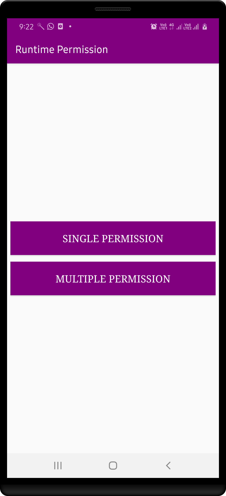
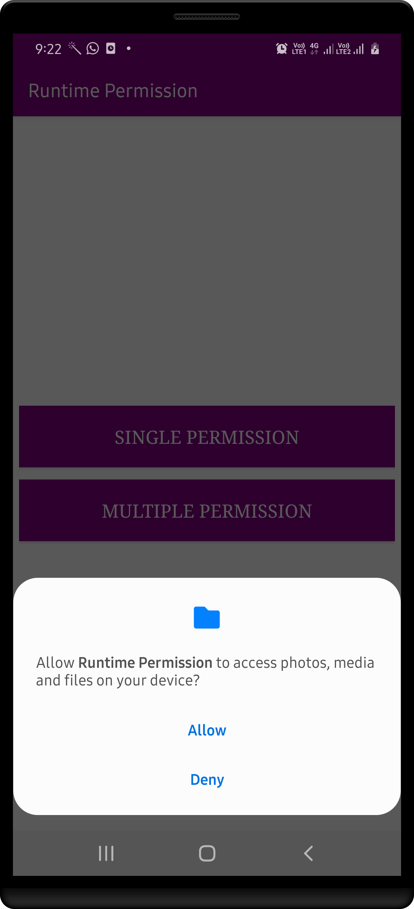
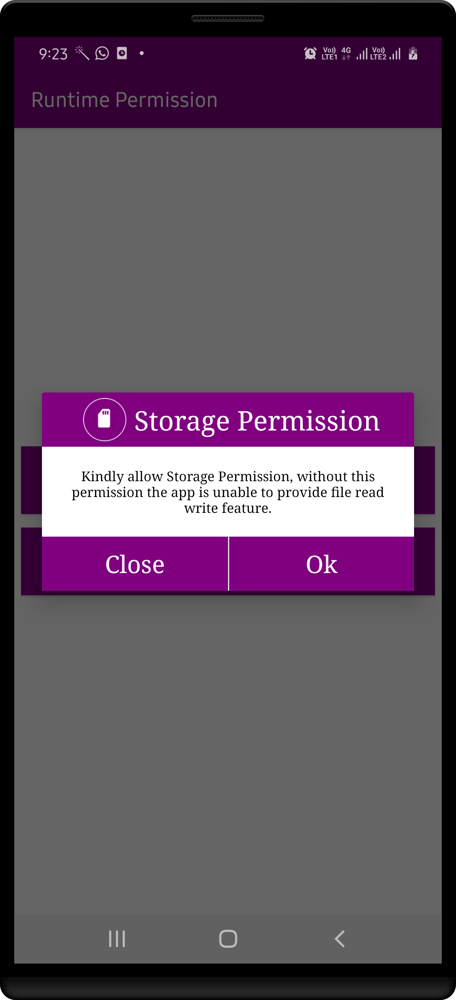
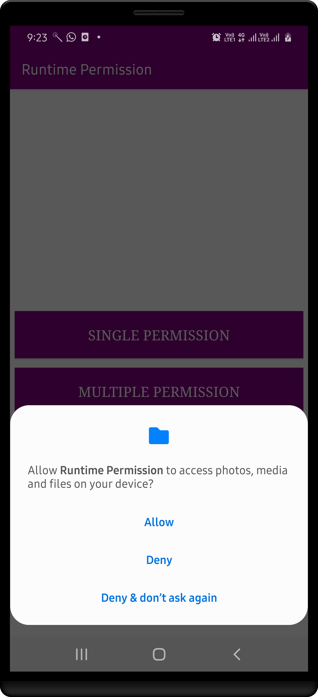
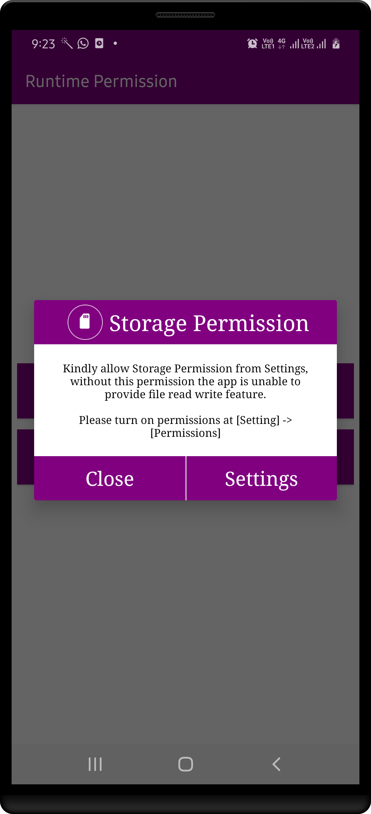

# JAVA - Network #

Let RuntimePermission support

- Single Permission
- Multiple Permission
- With Custom UI
- With Permission Callback

| First      | Second   | Third   |
|------------------|-----------------|-----------------|
|  |  |  |

| Fourth      | Five   |
|------------------|-----------------|
|  |  |

## Author ##

Rohit Yadav

[rohitnotes24@gmail.com](mailto:rohitnotes24@gmail.com)

[http://badasoftware.com/](http://badasoftware.com/)
